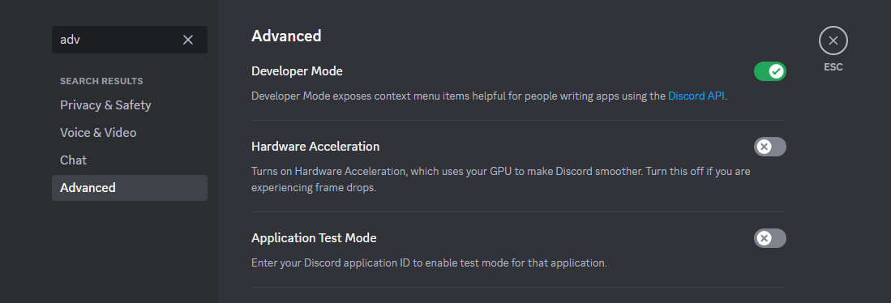

# DiscordBotBlueprint
A blueprint for a Discord Bot in Python. 

## Setup Discord
1. Enable Discord Developer Settings: <br>

2. Go to this [Link](https://discord.com/developers/applications/)
3. Click on New Application and Choose a Name 
4. Click on the left sidebar on Bot and choose the Bot Privileges and Permissions.
5. Reset and Copy the Token.
6. Click on the left sidebar on OAuth2 and in the OAuth2 URL Generator click on bot.
7. Give it the right Permissions and copy the invite Link.
8. Paste the invite link in the browser and invite the Bot to a Server. 
9. Start the python application and send a message on the server. 

## Start Bot 
Make sure you have Docker installed.<br>
Inside of the parent directory run: 
```
docker-compose up --build
```

Happy Hacking!